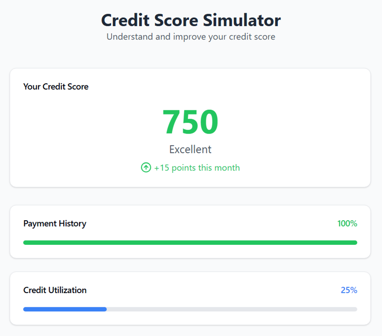
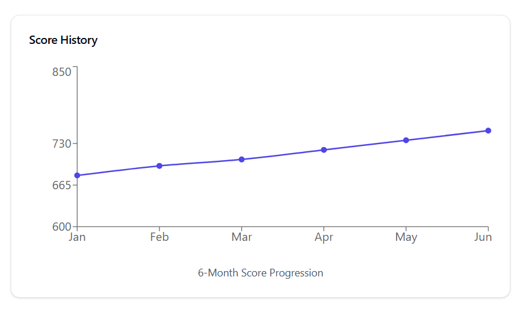
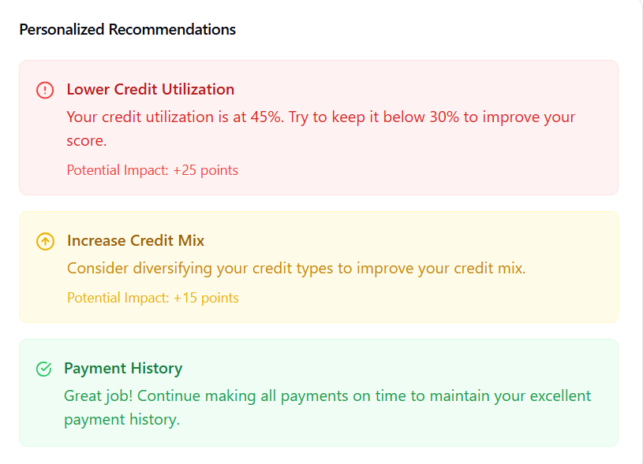

# Credit Score Simulator

An interactive educational tool for understanding and simulating credit score factors.

## Features

### Main Dashboard

- Real-time credit score display
- Color-coded score ranges
- Quick view of key factors
- Score trend indicators

### Score History Tracking

- 6-month score progression
- Interactive line chart
- Score range visualization
- Monthly trend analysis

### Personalized Recommendations

- Priority-based suggestions
- Impact estimates
- Action items for improvement
- Progress indicators

## Mobile View
- Fully responsive design
- Touch-friendly controls
- Optimized mobile layout
